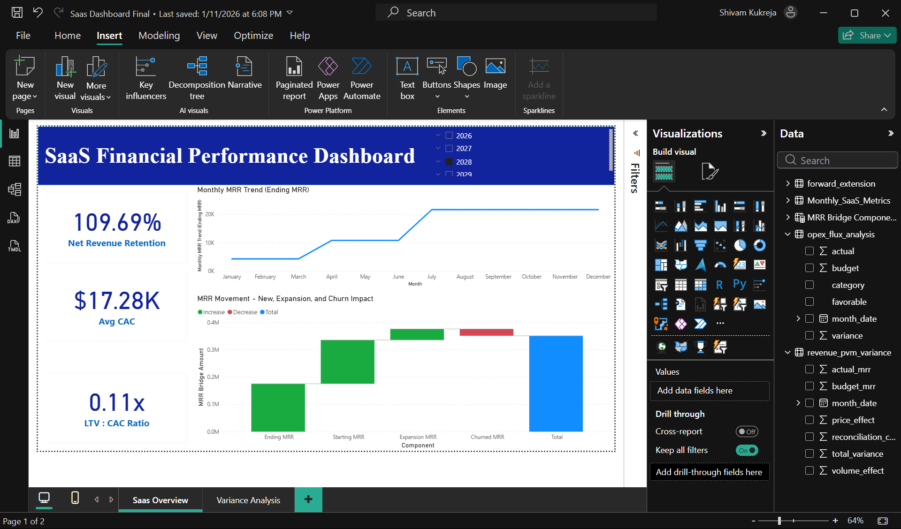
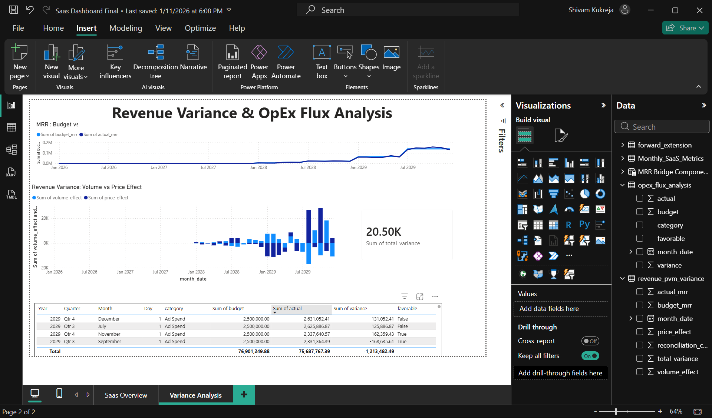

# FP&A Automation Pipeline

Automated SQL to Python to Power BI pipeline replicating a real month-end
Budget vs Actual (BvA) variance analysis, with an AI-generated executive
commentary layer.

The underlying SaaS financial model (revenue, headcount, and OpEx build)
was built independently as a separate financial modeling exercise; this
project automates the analysis layer on top of it.

## Problem
Manual month-end variance analysis in Excel is slow and hard to scale.
This project automates the full workflow: raw financial model, relational
database, Python-based PVM variance decomposition, BI dashboard, and
AI-written commentary.

## Approach
1. **SQL (MySQL)**: normalized schema (income statement, balance sheet, cash
   flow, headcount, SaaS metrics) with Budget/Actual scenario columns.
2. **Python**: ETL pipeline loading the SQL tables, plus a PVM (Price/Volume)
   revenue variance decomposition verified to reconcile exactly to total
   variance, and a full OpEx flux (Budget vs Actual) analysis by category.
3. **Power BI**: two-page dashboard, SaaS performance overview and a
   dedicated variance analysis page (MRR trend, PVM waterfall, OpEx flux table).
4. **AI commentary**: an LLM-generated executive variance narrative built
   directly from the Python output, mirroring how an analyst writes month-end
   commentary by hand.

## Dashboard

## Tools
MySQL, Python (pandas, SQLAlchemy), Power BI, OpenAI API

## Files
- `schema.sql`: MySQL table definitions for all 5 tables (income statement, balance sheet, cash flow, headcount, SaaS metrics)
- `etl_pipeline.py`: extracts source data, loads MySQL with Budget/Actual scenarios
- `forecast_pvm.py`: PVM variance decomposition, OpEx flux analysis, forward trend extension
- `ai_commentary.py`: generates AI-written variance commentary from the analysis output
- `output/`: generated CSVs and commentary log
